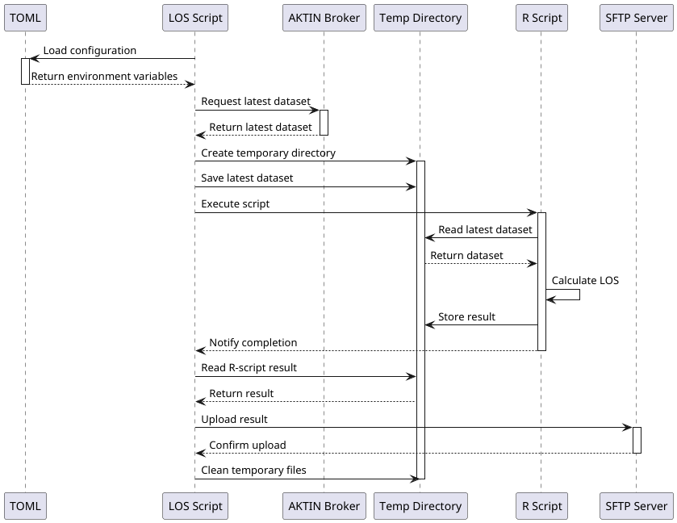

# rki-los-uploader  

A script that downloads case data from connected AKTIN emergency departments and calculates the average Length of Stay (LOS) data. Results are
uploaded to an SFTP server for accessibility and further processing by a third party.

## Overview



## Installation

**Prerequisites** : Python and R

1. Install Python dependencies ([requirements.txt](requirements.txt)):

```bash
pip install -r requirements.txt
```

2. Install R dependencies ([requirements.R](requirements.R)):

```bash
R -f requirements.R
```

If you encounter problems installing the R packages, some further packages may be required, i.e. on Ubuntu 20.04:

```
libxml2-dev libfontconfig1-dev libfreetype6-dev libharfbuzz-dev libfribidi-dev libpng-dev libtiff5-dev libjpeg-dev libcurl4-openssl-dev libssl-dev libgit2-dev libsodium-dev libcairo2-dev libxt-dev
```

3. Add R to PATH:

```bash
export PATH=$PATH:/usr/lib/R
```

## Configuration

Create a `config.toml` outside project directory:

#TODO

| Section  | Key                | Description                                                                                                                                                                          | Example                        |
|----------|--------------------|--------------------------------------------------------------------------------------------------------------------------------------------------------------------------------------|--------------------------------|
| BROKER   | URL                | URL to AKTIN Broker                                                                                                                                                                  | "localhost:8080/aktin-broker/" |
|          | API_KEY            | Admin Authentication key                                                                                                                                                             | "api_key"                      |
| REQUESTS | TAG                | Tag to filter AKTIN requests by                                                                                                                                                      | "test"                         |
| SFTP     | HOST               | SFTP server address                                                                                                                                                                  | "127.0.0.1"                    |
|          | PORT               | SFTP port                                                                                                                                                                            | "22"                           |
|          | USERNAME           | SFTP username                                                                                                                                                                        | "user"                         |
|          | PASSWORD           | SFTP password                                                                                                                                                                        | "pass"                         |
|          | TIMEOUT            | Connection timeout (seconds)                                                                                                                                                         | "25"                           |
|          | FOLDER             | Target upload directory on SFTP server                                                                                                                                               | "test"                         |
| RSCRIPT  | LOS_SCRIPT_PATH    | Absolute path to LOSCalculator.R                                                                                                                                                     | "/path/to/LOSCalculator.R"     |
|          | LOS_MAX            | Maximum Length Of Stay threshold before a case is excluded from calculation                                                                                                          | "30"                           |
|          | ERROR_MAX          | Maximum percentage of excluded cases allowed for a hospital before it is excluded from the calculation                                                                               | "0.05"                         |
|          | CLINIC_NUMS        | Defines the whitelist of clinic IDs for Rscript processing, supporting both individual IDs and ranges                                                                                | "1-7,9,10-12"                  |
| -        | REQUESTS_CA_BUNDLE | (optional) Specifies the path to a custom Certificate Authority (CA) bundle file that enables secure HTTPS connections to servers using non-standard or self-signed SSL certificates | "path/to/ca-bundle"            |

## Usage

```bash
python3 /path/to/los_script.py /path/to/config.toml
```
