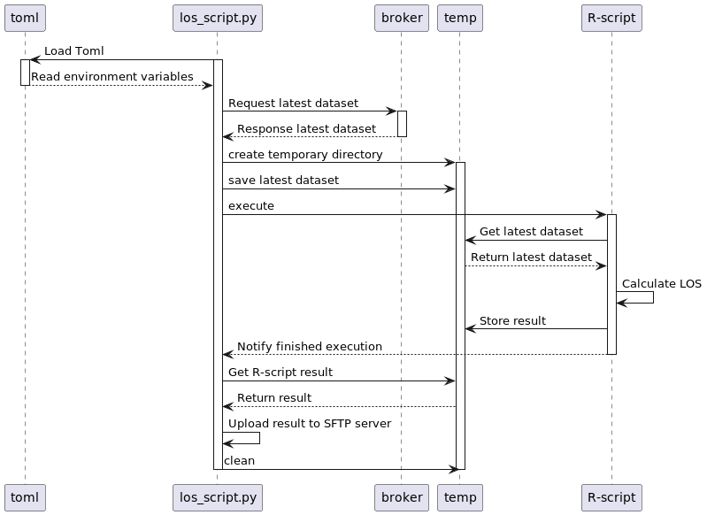

# Length of Stay Calculator
Script that imports emergency department case data and calculates a mean for a patient stay times. A SFTP Uploader replaces the old Length of Stay (LOS) from the SFTP server of RKI with our newly calculated one.

The import and upload process is executed in the python script "los_script.py". The new LOS is calculated in a R-script that stores the result in a csv file in a temporary project directory. The dataset will be imported from the AKTIN broker.


# Preparation
You need:
1. a distribution of R (we used 4.1.2)
2. The R-packages listed below
3. Python (we used version 3.10) 

## Install R and R packages "conflicted"," dplyr", "readr", "tidyverse", "lubridate", "mosaic", "ISOweek", "r2r"
First install a distribution of R and the mentioned packages in this title.
Set R path in PATH VARIABLES of the system. For Linux, paste the following command in the Terminal. Normally the R executable should be installed to the given 
directory, if not change the path: 

***Set PATH to R in Linux*** 

```export PATH=$PATH:/usr/lib/R```

### Trouble installing R packages
If you encounter Problems installing R packages with 'install.package', use this command in the terminal and try to install again:
```sudo apt install libssl-dev libcurl4-openssl-dev unixodbc-dev libxml2-dev libmariadb-dev libfontconfig1-dev libharfbuzz-dev libfribidi-dev libfreetype6-dev libpng-dev libtiff5-dev libjpeg-dev```

## Configuration TOML
Create a file with .toml as its ending. Use this template for your toml and change the values for BROKER.URL, BROKER.API_KEY, MISC.WORKING_DIR, RSCRIPT.SCRIPT_PATH, RSCRIPT.R_DIRECTORY, SFTP.USERNAME, SFTP.PASSWORD:

```
[BROKER]
URL = "BrokerURL"
API_KEY = "YourBrokerKey"

[REQUESTS]
TAG = "pandemieradar"

[MISC]
WORKING_DIR = 'ProjectDirectory(.../LOC_Calculator)'
TEMP_ZIP_DIR = 'src/resources/temp'

[RSCRIPT]
SCRIPT_PATH = 'FullPathToTheRScript(.../src/resources/LOSCalculator.R)'
R_DIRECTORY = 'DirectoryToRBinary(example: /usr/lib/R/bin/R, on Linux)'

[SFTP]
HOST = "127.0.0.1"
USERNAME = "sftpuser"
PASSWORD = "sftppassword"
TIMEOUT = "25"
FOLDERNAME = "rki"
```

# Execute script
The file "rki_upload_newest_los.sh" is located in the project directory and can be executed manually or via terminal. Open a command prompt and move to the project directory

```cd PathToYourProject/LOC_Calculator```

Then execute the bash script

```sudo ./rki_upload_newest_los.sh```


